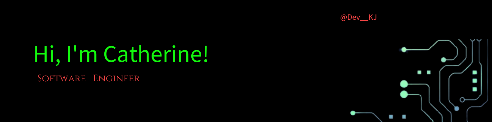
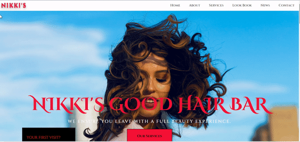
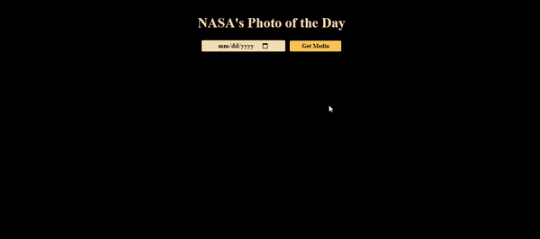
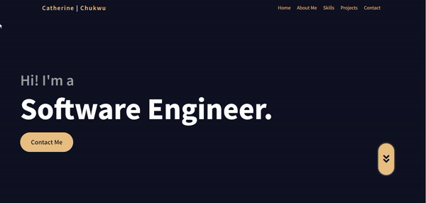

    Hi! I'm Catherine, a Software Engineer passionate about technology, with a background in cryptocurrency and real estate marketing. I'm currently open to new connections as well as opportunities. Please reach out to me me through email, twitter or Linkedin.

<!--Project Section -->
<h1 align="center">Projects</h1>
<table bordercolor="#66b2b2">
  
  <tr>
    <td width="50%" valign="top">
      <h3 align="center">Nikkis good hair bar</h3>
           
        
         
        

          
  
  </a>  
  
      

        
<strong>Javascript, CSS</strong> - landing page for a women's saloon!

    </td>
    <td width="50%" valign="top">
      <h3 align="center">Omoni Cuisine Restaurant"</h3>
         
      
         
        

          
  
  
      

        
<strong>Javascript, Bootstrap, PHP, Jquery</strong> - A restaurant website for Omoni Cuisine.

    </td>
  </tr>
  
  <tr>
    <td width="50%" valign="top">
      <h3 align="center">Nasa API</h3>
       
        
       
        

  
  
      

        
<strong>HTML5, CSS3, & Javascript</strong> -NASA Photo of the Day API.

    </td>
    <td width="50%" valign="top">
      <h3 align="center">Catherinekj.netlify.app</h3>
         
        
         
        

          
  
  
      

        
<strong>HTML5, CSS3, & Javascript</strong> - Predicts your next vacation city with speech synthesis API

    </td>
  </tr>
</table>

  <!--Analytics & Data-->
<h2 align="center">Data & Analytics</h2>

<table>
<tr>
<td width="50%">

</td>
<td width="50%">

</table>

<h2 align="center">Technologies</h2>

<h2 align="center">Let's Connect</h2>

